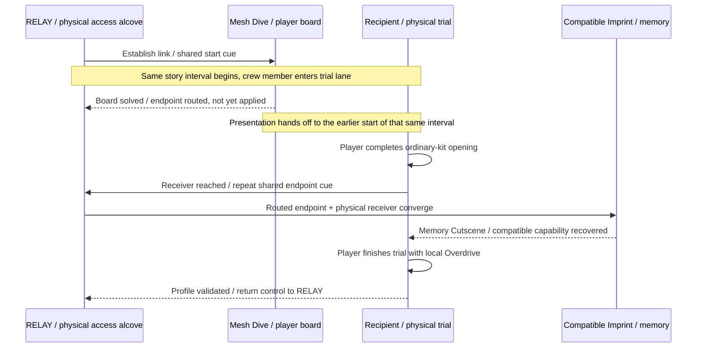

## Purpose

Follow RELAY's recovered access path into Helix's isolated system, recover four compatible Overdrive Imprints through physical crew trials, and reconnect the infrastructure that opens Act II.

| Boundary | Working version |
|---|---|
| Deployment | All four crew members physically deploy in their own Coffins. RELAY / Wire is the primary controlled Character; ROOK / Tactical, VECTOR / Ghost and RAM / Impact take scripted trial turns. |
| Player control | One controlled Character or Mesh Dive board at a time. No free Character switching, companion AI, general party deployment or Specialization selection within the Mission. |
| Trial order | Four mandatory branches, selectable in any order. A branch completes before another begins; none needs another recipient's Overdrive. |
| Discovery | Access → ordinary-kit trial → convergence and memory → trial-only Overdrive → profile validation. Retrieved memories are not recordings of the present trial. |
| Completion | Four validated crew profiles release the core interlock. Core validation commits the collective unlock; four separate Coffins return the crew to the same physical Hub, now HUB1. |

> **Accepted — Physical crew action:** The other three trials are real events in the facility during RELAY's Mesh Dives, not virtual avatars, possession or playable reconstructions of the memories. M05 is the sole whole-crew deployment and scripted control-transfer exception.

## Mission structure

> **TODO — Room blockout and trial authoring:** Validate the junction, paired access/trial spaces, safe waiting positions and core approach. Playtest the authored E008–E010 placements and starting counts below; define the four Act II biome archetypes, their additional placement counts, receiver machinery and precise completion conditions. Schematics do not establish damage values or measured geometry.

[[Cutscenes/CS006|CS006]] supplies the post-M04 Hub lead. M05 starts with playable RELAY in R01 after separate Capsule arrivals. See [[Wiki Rules?section=mission-room-graphs|Mission room graphs]] for diagram conventions.

```mermaid
flowchart TB
    subgraph Legend[Legend — primary room purpose]
        L["🟦 Arrival / access<br/>🟨 Junction / validation<br/>🟥 Physical trial<br/>🟩 Extraction<br/>💬 Radio / crew communication<br/>🎬 Memory Cutscene · pauses play"]
    end
    R01["R01 · Crew receiving dock · 0:45<br/>Four separate Coffins · control RELAY"] --> R02["R02 · Trial junction · 1:15 total visits<br/>Four branches · sealed core interlock"]
    R02 --> R03["R03 · ROOK access · 0:30<br/>RELAY begins Dive · ROOK stages separately"]
    R03 --> R04["R04 · ROOK physical trial · 2:00<br/>Ordinary-kit pressure → receiver → Fire Control"]
    R04 -->|Validation complete / control RELAY| R02
    R02 --> R05["R05 · VECTOR access · 0:30<br/>RELAY begins Dive · VECTOR stages separately"]
    R05 --> R06["R06 · VECTOR physical trial · 2:00<br/>Approach / attack / relocate → receiver → Blind Spot"]
    R06 -->|Validation complete / control RELAY| R02
    R02 --> R07["R07 · RAM access · 0:30<br/>RELAY begins Dive · RAM stages separately"]
    R07 --> R08["R08 · RAM physical trial · 2:00<br/>Frontal guard / charge → receiver → Counteroffensive"]
    R08 -->|Validation complete / control RELAY| R02
    R02 --> R09["R09 · RELAY access · 0:30<br/>Wire Dive · no parallel Character handoff"]
    R09 --> R10["R10 · RELAY physical trial · 1:30<br/>Total Integration → module-coordination finish"]
    R10 -->|Validation complete / remain RELAY| R02
    R02 -->|All four profiles validated| R11["R11 · Imprint validation core · 1:00<br/>Collective unlock · reconnect Research Core"]
    R11 --> R12["R12 · Crew return dock · 0:30<br/>Four separate Coffins → HUB1"]
    R04 -->|At convergence / before Overdrive finish| CS007[["🎬 CS007 · ROOK memory<br/>+0:30 target · pauses play"]]
    R06 -->|At convergence / before Overdrive finish| CS008[["🎬 CS008 · VECTOR memory<br/>+0:30 target · pauses play"]]
    R08 -->|At convergence / before Overdrive finish| CS009[["🎬 CS009 · RAM memory<br/>+0:30 target · pauses play"]]
    R09 -->|Own Dive endpoint / before R10| CS010[["🎬 CS010 · RELAY memory<br/>+0:30 target · pauses play"]]
    click CS007 href "#/cutscenes/cs007"
    click CS008 href "#/cutscenes/cs008"
    click CS009 href "#/cutscenes/cs009"
    click CS010 href "#/cutscenes/cs010"

    R01 -.- COM01(["💬 COM01 · OPERATOR / ROOK / RELAY<br/>Four arrivals · confirm safe staging"])
    R02 -.- COM02(["💬 COM02 · RELAY / crew<br/>Choose a branch · four incomplete channels"])
    R03 -.- COM03(["💬 COM03 · RELAY / ROOK<br/>Link start · firing lane ready"])
    R05 -.- COM04(["💬 COM04 · RELAY / VECTOR<br/>Link start · concealment route ready"])
    R07 -.- COM05(["💬 COM05 · RELAY / RAM<br/>Link start · frontal lane ready"])
    R09 -.- COM06(["💬 COM06 · RELAY / ROOK<br/>Own link · crew waits safely"])
    R02 -.- COM07(["💬 COM07 · RELAY / recipient<br/>After branch finish · profile validated"])
    R11 -.- COM08(["💬 COM08 · RELAY / crew / OPERATOR<br/>After core commit · collective unlock / Hub handoff"])
    R12 -.- COM09(["💬 COM09 · OPERATOR / crew<br/>Separate Coffins · return to the same Hub"])
    R04 -.- COM10(["💬 COM10 · RELAY / crew<br/>After memory · activation instructions<br/>First convergence explains Overdrive"])
    R06 -.- COM10
    R08 -.- COM10
    R09 -.- COM10

    R04 -.- C04["Opening: (1)<a href='#/enemies/e008'>E008</a><br/>Finish: (1)<a href='#/enemies/e009'>E009</a> · (2)<a href='#/enemies/e010'>E010</a><br/>Additional finish enemies: Exx[MA02] · Exx[MB01]"]
    R06 -.- C06["Opening: (1)<a href='#/enemies/e010'>E010</a><br/>Finish: (1)<a href='#/enemies/e008'>E008</a> · (1)<a href='#/enemies/e010'>E010</a><br/>Additional finish enemies: Exx[MC02] · Exx[MD02]"]
    R08 -.- C08["Opening: (1)<a href='#/enemies/e008'>E008</a><br/>Finish: (2)<a href='#/enemies/e009'>E009</a> · (1)<a href='#/enemies/e010'>E010</a><br/>Additional finish enemies: Exx[MD01] · Exx[MB02]"]
    R10 -.- C10["Finish: (1)<a href='#/enemies/e008'>E008</a> · (1)<a href='#/enemies/e009'>E009</a> · (1)<a href='#/enemies/e010'>E010</a><br/>Additional finish enemies: Exx[MC01] · Exx[MA01]"]

    classDef access fill:#dbeafe,stroke:#2563eb,color:#1e3a8a;
    classDef validation fill:#fef3c7,stroke:#d97706,color:#78350f;
    classDef trial fill:#fee2e2,stroke:#dc2626,color:#7f1d1d;
    classDef extraction fill:#dcfce7,stroke:#16a34a,color:#14532d;
    classDef cutscene fill:#e0f2fe,stroke:#0891b2,color:#164e63,stroke-width:2px;
    classDef communication fill:#f8fafc,stroke:#64748b,color:#334155,stroke-width:1px,stroke-dasharray:4 3;
    classDef roomContent fill:#f8fafc,stroke:#64748b,color:#334155,stroke-width:1px,stroke-dasharray:7 5;
    classDef legend fill:#f8fafc,stroke:#94a3b8,color:#334155;
    class R01,R03,R05,R07,R09 access;
    class R02,R11 validation;
    class R04,R06,R08,R10 trial;
    class R12 extraction;
    class CS007,CS008,CS009,CS010 cutscene;
    class COM01,COM02,COM03,COM04,COM05,COM06,COM07,COM08,COM09,COM10 communication;
    class C04,C06,C08,C10 roomContent;
    class L legend;
    linkStyle 15,16,17,18 stroke:#0891b2,stroke-width:1px;
    linkStyle 19,20,21,22,23,24,25,26,27,28,29,30,31 stroke:#64748b,stroke-width:12px,stroke-dasharray:1 22,stroke-linecap:round;
    linkStyle 32,33,34,35 stroke:#64748b,stroke-width:2px,stroke-dasharray:7 5;
```

**Placeholder notation:** `Exx[MA01]` means an undefined Enemy archetype introduced here and later reused in MA01, the Mission containing one of this recipient's two later Specialization Imprints. `Exx` is not an allocated Enemy ID; brackets indicate design provenance, not a player-facing name or early unlock. These placeholders have no links, quantities, stats or authored attacks yet.

There are **four additional archetypes total, one per Act II biome**: B03 is shared by MA01/MA02, B04 by MB01/MB02, B05 by MC01/MC02, and B06 by MD01/MD02. Each trial previews two distinct biomes corresponding to its recipient's later Imprint locations; two Mission labels from the same biome refer to the same reusable archetype, not separate bots. Their factory introduction and later reuse share the enemy asset/behaviour definition rather than requiring factory-only variants. The graph reserves their additional finish placements; it does not claim that all Act II enemies originate at Helix.

The paired spaces are physically connected but only the branch's assigned crew member enters its trial lane. RELAY's interface occupies a protected alcove; inactive crew use authored safe staging and scripted transit. No off-screen combat simulation, escort health bar or vulnerable unattended body runs alongside the board. The graph's scene attachments are presentation events, not alternative room routes.

### Encounter staging

> **TODO — Trial combat blockout:** Define the four biome archetypes with their Act II Mission owners before assigning Enemy IDs, behaviour, quantities or exact activation order to the Exx slots. Validate the combined encounter counts, ordinary-kit openings, safe receivers, staggered finish activations and readable Overdrive demonstrations against each recipient's actual kit. Author sightlines, cover, climbable surfaces and charge run-up; do not infer new attacks or damage bonuses from a placeholder.

Use the existing Helix [[Enemies/E008|Fabricator]], [[Enemies/E009|Line Runner]] and [[Enemies/E010|Process Warden]] cycles alongside the reserved Act II archetypes. Graph quantities are authored starting tuning values, not concurrent-threat quotas; they count only the defined Helix placements, not the unquantified Exx additions. Each room has one content block, split into opening and finish placements where applicable. Enemy pages own reusable behaviour, not these trial arrangements.

The staging below describes the defined Helix actors. Exx actors join only the Overdrive finishes, under the same safe-handoff and room-local rules; their detailed choreography remains unauthored. Their presence foreshadows future enemies without granting the associated Specializations, their equipment, Imprints or research rewards. Revalidate the existing duration targets once these combined encounters are playable.

| Room / phase | Working local staging and lesson |
|---|---|
| R04 / ordinary kit | A low Fabricator blocks the approach between readable firing positions. Clear it using the ordinary rifle/positioning loop, then reach the safe receiver; no concealed Overdrive is needed. |
| R04 / Fire Control finish | Activate the Runner and Wardens in staggered groups, with an open repositioning lane and visible pulse tells. Repeated firing-position changes and slide-to-fire transitions expose Fire Control's handling changes; do not substitute increased rifle damage or an inflated-health target. |
| R06 / ordinary kit | One reachable Warden covers an approach lane with its normal scan/pulse tell. Give VECTOR cover and a climbable bypass for approach, attack and relocation before the receiver; no new camouflage-detection rule. |
| R06 / Blind Spot finish | Separate the Fabricator and Warden across cover and climbable transitions. Attacks still break concealment; relocation supplies the damage-free/contact-free recovery space before the next approach. Demonstrate sustained camouflage and faster climbing, not invulnerability. |
| R08 / ordinary kit | One low Fabricator gives RAM a readable frontal commitment, ordinary guard and punish opportunity. Clear the approach before the safe receiver; no rear ambush or forced damage. |
| R08 / Counteroffensive finish | A Warden supplies telegraphed frontal pulses; Runners occupy a broad charge lane and activate in staggered order. Show guarded-hit storage, the committed advance through standard enemies and the Gauntlet follow-up under [[Characters/Ram#c31|Impact's rules]]. Leave room to brake, evade and recover; not every collision is automatically guardable. |
| R10 / Total Integration finish | RELAY enters only after her own memory. Stagger short-reach cutting, grounded transport and scan/pulse pressure so her installed Weapon, Mobility and Systems functions can form one coordinated sequence. Frame destruction restores the same kit for another local activation; no machine harvesting, new Chassis or Blueprint reward. |

For this tutorial deployment, Wire installs her already-owned Arc Cutter, Runner Legs and Sensor Array before arrival. This is an authored M05 configuration of the [[Characters/Relay#machine-arsenal-ownership|existing three Helix modules]], not a change to her general starter loadout, whose Weapon slot initially remains empty. Nothing is awarded or replaced in the field to make Total Integration available.

Finish placements remain dormant until the watched/skipped memory handoff and activation instructions complete. Safe receiver pockets cannot be attacked; the recipient explicitly leaves one to begin the finish. Enemies remain room-local, cleared actors do not respawn, and no hostile enters an access alcove, junction, core or dock. Local clears and the authored Overdrive demonstration secure the branch before its return opens; killing opening enemies alone never validates a profile. No Boss, endless wave, fragile escort or timed defence is added.

### Communication beats

> **TODO — Dialogue and localization:** Write the ten COM beat families and recipient/order variants, then add matching gettext entries. Define interruption and replay behaviour in a playable handoff. Labels below describe intent, not exact dialogue; no nonexistent dialogue entry is linked.

| Beat | Trigger / intent |
|---|---|
| COM01 | R01 after all four arrivals: OPERATOR confirms arrivals; ROOK coordinates safe staging while RELAY identifies the access route. No prior knowledge of stored contents. |
| COM02 | First R02 entry: explain free branch order and the sealed four-channel interlock without calling the contents Overdrive or Imprints before the first memory. Later junction visits use current channel-state wording, not the initial briefing again. |
| COM03 | R03 before ROOK's Dive/handoff: RELAY and ROOK establish the shared start cue and physical firing lane. No claim that the board finished before ROOK began acting. |
| COM04 | R05 before VECTOR's Dive/handoff: RELAY and VECTOR establish the same overlap, with approach/relocation guidance rather than early Blind Spot knowledge. |
| COM05 | R07 before RAM's Dive/handoff: RELAY and RAM confirm frontal staging and receiver access, not a promise of shield immunity. |
| COM06 | R09 before RELAY's own Dive: RELAY confirms the link; ROOK acknowledges protected waiting positions. No invented parallel action by RELAY's unattended body. |
| COM07 | R02 after each successful branch: RELAY and that recipient acknowledge its newly validated channel. Four recipient variants, with an all-four-ready variant after the final branch; returning to the junction alone cannot retrigger a validation or award. |
| COM08 | R11 after the explicit core commit: acknowledge collective activation and the Research Core / Hub handoff. No certainty about memory ownership or manufactured identity. |
| COM09 | R12 after the safe return is ready: OPERATOR coordinates separate boarding and return to the same Hub. No automatic Act II deployment. |
| COM10 | After CS007, CS008, CS009 or CS010, before the finish starts: RELAY/crew give the active recipient's activation instructions. The first convergence in any order introduces Overdrive; later variants use the known name. Essential instructions remain available after scene skip. |

COM beats use active-play communication/handoff presentation, not additional paused Cutscenes or duplicate memory dialogue. Pause radio during boards, Character transitions and scenes; defer only still-relevant lines. COM10 completes in the safe activation pocket before finish enemies activate, without adding a hidden countdown. Extraction ends unfinished in-Mission radio. Existing physical-time targets include these exchanges; scene duration accounting is unchanged.

## Parallel events and control handoff

> **TODO — Synchronization presentation:** Block out repeated sound/prop cues, radio ordering, transition labels and the convergence frame. Verify that players understand simultaneous present-day action without mistaking the overlap for a past memory or playing the same interval twice.

```mermaid
sequenceDiagram
    participant R as RELAY / physical access alcove
    participant M as Mesh Dive / player board
    participant C as Recipient / physical trial
    participant I as Compatible Imprint / memory
    R->>M: Establish link / shared start cue
    Note over R,C: Same story interval begins, crew member enters trial lane
    M-->>R: Board solved / endpoint routed, not yet applied
    Note over M,C: Presentation hands off to the earlier start of that same interval
    C->>C: Player completes ordinary-kit opening
    C->>R: Receiver reached / repeat shared endpoint cue
    R->>I: Routed endpoint + physical receiver converge
    I-->>C: Memory Cutscene / compatible capability recovered
    C->>C: Player finishes trial with local Overdrive
    C-->>R: Profile validated / return control to RELAY
```

World simulation pauses during the board and Cutscene. This is sequential presentation of overlapping events, not a new unpaused hacking mechanic. A shared relay click, moving shutter and radio beat establish the interval's beginning and end; the crew-member segment re-presents the beginning from the other side. Dialogue must not say the Dive finished before that member began acting. Physical trial time is counted once, despite the perspective change.

Successful routing alone does not apply the Imprint. For the three other recipients, the ordinary-kit opening ends at a physical receiver; reaching it converges with RELAY's routed endpoint. The memory then plays, and the recipient recognizes the demonstrated technique. RELAY reconnects a compatible stored pattern through the authored link, not a replacement consciousness or fabricated body. Exact receiver hardware and coupling animation remain blockout tasks; this local application does not settle general Imprint transfer or inventory rules.

RELAY's own branch has no parallel Character segment: route the endpoint, present CS010, resume as Wire at the interface, then enter R10 to use Total Integration. She does not move through a second physical scene while her own body is immobilized in a Dive.

## Dive boards and trial lessons

> **TODO — Puzzle and encounter prototypes:** Produce four individually solvable boards and playable baseline/Overdrive halves. Tune each finish so the changed behaviour is necessary and legible without inventing damage bonuses, invulnerability, new moves or permanent equipment.

Each access board uses the shared [[Characters/Relay#combat-hacking|circuit-routing grammar]], a fixed authored move budget, a valid starting solution and unlimited short-reset retries. No combat Access buildup, Data Fragment nodes, Blueprint rewards, Null Hack Modules or Program Execution apply. Each branch teaches its own board variation regardless of order; failure resets only that board, before any Character handoff.

| Branch | Self-contained Dive lesson | Ordinary-kit opening → Overdrive finish |
|---|---|---|
| ROOK | Connect one source to its endpoint; reroute around a blocked cell. | Establish a safe firing position and reach the receiver; finish a firing/movement sequence emphasizing [[Characters/Rook#c11|Fire Control]], not increased rifle damage. |
| VECTOR | Select a viable path around locked cells; preview before committing. | Approach, strike and relocate to the receiver; finish successive concealment/climbing transitions using [[Characters/Vector#c21|Blind Spot]], not invulnerability or uninterrupted invisibility while attacking. |
| RAM | Reconnect separated circuit segments without exceeding the fixed budget. | Face frontal pressure, guard and reach the receiver; finish a guarded-hit/committed-charge sequence using [[Characters/Ram#c31|Counteroffensive]], not a new shield or universal protection. |
| RELAY | Route through required intermediate connections before the endpoint. | Safely operate the interface with her existing three-module Wire kit; finish a coordinated module sequence using [[Characters/Relay#overdrive--total-integration|Total Integration]], not a harvested Chassis or new integration reward. |

The unfinished trial waits safely at the activation point; there is no hidden countdown, mandatory damage or early unwinnable fight. After the memory, the current recipient receives unlimited trial Overdrive availability: recharge does not require farming, expiry permits immediate reactivation, and a destroyed RELAY frame restores her existing kit for another activation. Transformation-specific states and resource rules still apply. Branch completion removes this local grant before control returns to RELAY; the global unlock is still pending.

## Profile interlock and final activation

> **TODO — Machinery and system handoff:** Define readable validation channels, core interaction, extraction prerequisites and HUB1 activation feedback. Validate every branch order without premature unlocks or duplicate starter rewards.

R02's sealed physical door has four compatibility channels corresponding to the crew. An unfinished channel remains visibly incomplete; completing a branch lights only its recipient's channel. These are validated profiles, not carryable keys, Blueprint tracks, Memory Imprint collectibles placed in the room or the later Mnemonic Voiceprint password. All four completed validations release the door to R11. Simply watching four memories or solving four boards is insufficient.

| Event | Mission-local consequence / progression boundary |
|---|---|
| Dive solved | Cache the routed endpoint for the current branch; do not validate its profile. |
| Receiver reached + route ready | Recover that compatible Overdrive Imprint, present its scene and grant trial-only activation. RELAY uses her own endpoint instead of another recipient's receiver. |
| Overdrive finish completed | Validate the recipient profile, secure the branch and return to RELAY. Completed branches cannot farm additional rewards. |
| Four profiles validated | Open the core interlock; retain control of RELAY. No free switching or automatic Mission success. |
| Explicit R11 core validation | Commit [[Gameplay/Overdrive#initial-concealment-and-unlock|the collective Overdrive unlock]] and activate the persistent [[Gameplay/Blueprints#activation|Research Core / Blueprint handoff]]. Import existing starter records through [[Machine Profiles/Overview#starting-profiles|their owner]], not another arsenal reward. |
| R12 explicit crew return | Script separate boarding into four personal Coffins, return to [[Missions/HUB1|HUB1]] and expose its now-functional route, research, analysis and evidence interfaces. Do not relocate the Hub or launch an Act II Mission automatically. |

R11 is a safe validation room; its interaction commits Mission completion and progression together before the noncombat return sequence. The dock is presentation/transit after that commit, not a later lethal challenge that can retract the unlock. The core confirms compatibility between stored Imprints and the four crew profiles, never original/copy/reconstructed/manufactured/composite identity. Research capability becomes useful at the Hub; M05 contains no ordinary Blueprint loot.

## Cutscene placements and mystery

> **TODO — Text and scene production:** Write exact localized exchanges, transition cues and the introductory Overdrive explanation after the first recovered pattern. Produce the scene pages' boards and measure playback; no generated image or placeholder supplies exact dialogue.

| Scene | Local trigger | Presentation owner |
|---|---|---|
| [[Cutscenes/CS007|CS007]] | R04 convergence, after its ordinary-kit opening and before its Overdrive finish. | ROOK memory |
| [[Cutscenes/CS008|CS008]] | R06 convergence, after its ordinary-kit opening and before its Overdrive finish. | VECTOR memory |
| [[Cutscenes/CS009|CS009]] | R08 convergence, after its ordinary-kit opening and before its Overdrive finish. | RAM memory |
| [[Cutscenes/CS010|CS010]] | R09's own routed endpoint, before RELAY enters R10. | RELAY memory |

The first completed convergence in the chosen order introduces the recovered system as Overdrive; later branches may use the name. Every memory remains self-contained and order-independent. Present-day trial overlap is explicit, but [[Imprints/Overdrive#memory-revelations|the four retrieved memories]] still do not establish a common time, location or rightful owner. Their shared announcement must not masquerade as the live trial synchronization cue.

Watching or skipping a memory commits the same local activation and resume state, not profile validation or the global unlock. Any explanation needed to operate Overdrive remains available in the gameplay handoff even if the scene is skipped. No memory scene silently completes its Overdrive challenge.

## Deployment, failure and persistence

> **TODO — Crew recovery validation:** Test protected inactive actors, active-recipient defeat, whole-crew Capsule return and all 24 branch orders. Verify that late failures do not leak trial-only Overdrive into HUB0 or turn knowledge retention into a progression unlock.

All four default configurations deploy from four occupied HUB0 stations in separate Coffins. Arrival and waiting-position changes are scripted; the player starts as RELAY and never selects an arbitrary active member. Inactive crew are not autonomous damage dealers. Do not copy a shared unique equipped item onto several active loadouts; equipment compatibility and ownership stay with their owners.

Defeat of the currently controlled physical Character before R11's completion commit fails the whole Mission. All four Coffins return to HUB0; the defeated recipient awakens in their own Capsule, while the others' return is safely scripted without an escort encounter or recovery explanation. Retain the roster, owned resources and already registered campaign rewards under [[Gameplay/Progression#death-and-mission-retry|shared recovery rules]]. Reset the trial lanes, routed endpoints, local Imprint activations, validation channels and deployment scene triggers; retry starts at R01 as RELAY, with no midpoint checkpoint. Viewed-memory records may persist as presentation history, but do not open the interlock or activate Overdrive in a failed run.

## Critical-path timing

> **TODO — Measured timing:** Playtest first-time runs for each branch order. Record physical traversal/action separately from interactive Mesh Dive time and paused memory playback. Targets exclude retries, loading and Capsule/transition overhead; observed medians and sample sizes are not yet available.

| Component | Target | Observed median | Runs |
|---|---:|---:|---:|
| Physical gameplay R01–R12, with R02 visits counted together | 13:00 | — | — |
| Four interactive Mesh Dive boards, 1:00 each | 4:00 | — | — |
| **Gameplay total including boards** | **17:00** | — | — |
| CS007–CS010, +0:30 each | +2:00 | — | — |
| **M05 sequence through crew return** | **19:00** | — | — |

The graph labels physical gameplay only; they exclude board-solving and paused Cutscenes. [[Cutscenes/CS006|CS006]] belongs to the post-M04 sequence, not this total. Temporal overlap does not deduct either playable perspective from player time or add the portrayed interval twice to story time.

## Mission layout

> **TODO — Spatial handoff:** Replace schematic footprints with measured side-scrolling blockouts. Check accessible interface alcoves, separate physical trial lanes, safe receiver platforms, return paths and the four-Coffin dock without introducing free crew traversal or optional branches.

## Gameplay presentation

> **TODO — Synchronization and activation visual study:** Review the generated studies below at gameplay scale, then block out the ordinary-kit opening, matched Dive/trial endpoints and memory-to-Overdrive handoff. Keep the Mesh board, present-day physical action and historical memory visually distinct; validate transition cues in motion.

The schematics are editable working references, not game captures, solved puzzle boards or proof of measured geometry. Character pages own the transformations; the trials demonstrate those mechanics without approving new values or origins.

### Generated study boundaries

The following are **generated mock screenshots, not build captures**, final assets, measured geometry or authored puzzle solutions. They use the existing crew turnarounds, B02 environment and E008–E010 machine sheets to explore a consistent Mission presentation; pictured counts, threat reach, receiver hardware, interface styling and transformation geometry remain subject to blockout and implementation review. This pass does not replace the editable SVGs or regenerate CS007–CS010's historical-memory storyboards.

**Exx designs remain undefined.** Opaque closed storage housings reserve future enemy presence without revealing a silhouette, attack, faction or factory-origin explanation. These studies are partial samples, not the complete trial roster; the four shared biome archetypes still need their owning Enemy definitions before a complete encounter can be pictured. No baked dialogue or gameplay HUD is authored here; incidental instrument markings or insignia carry no narrative meaning, and exact displayed text belongs to gettext.

### Isolated testing-wing study

Explore the testing wing's separation from active background production, four-Coffin arrival and repeated interface/receiver language. The cross-section is architectural mood, not the room graph's literal topology or four equally sized trial footprints.

### Dive and physical overlap study

Three views of the same present-day interval: protected RELAY, symbolic routing and ROOK's real ordinary-kit approach. They are played sequentially, not simultaneous split-screen controls. The board is not an authored solution, the right-hand action is not a memory, and the receiver's appearance does not establish an unlocked Research Terminal. The Fabricator faces toward ROOK after the facing correction.

### ROOK trial study

R04's local Fire Control finish explores handling and relocation with the ordinary rifle, not increased damage or new Equipment. Check the slide's permitted transition point, readable pulse tells, safe receiver access and staged activations; the image does not establish their frame timing.

### VECTOR trial study

R06 explores Blind Spot's attack–relocate–concealment rhythm with Kunai and Climbing Claws, not Phase's Katana or teleportation. Camouflage recovery and its damage-free/contact-free delay still need motion studies; the solid readable figure is not proof of uninterrupted invisibility. The Fabricator's cutter was corrected to face toward VECTOR's approach side.

### RAM trial study

R08 explores Counteroffensive's frontal guard and committed advance using Impact's introductory shield/gauntlet kit. The Gauntlet follow-up occurs after the charge, not during it; no gun, new shield, aura or universal protection is implied. Validate body/front orientation, run-up, contact and recovery against the defined rules.

### RELAY trial study

R10 explores Total Integration expanding the already-installed Arc Cutter, Runner Legs and Sensor Array into a standardized temporary frame. It is not a harvested Chassis, new module award or Network-controlled squad. Preserve RELAY's biological head/torso and biomechanical limbs; frame scale, running supports, sensor integration, activation/expiry and destruction transitions remain to be designed. The hostile Fabricator was corrected to oppose her cutter rather than face away.

### Collective validation-core study

R11's safe explicit commit is shown with four distinct crew, practical controls and four confirmation channels. This is collective completion staging, not free Character switching or companion AI. The powered conduit suggests reconnection without picturing Blueprint drops, Specialization rewards, research gameplay or certainty about memory ownership.
