## Purpose

> **TODO — Mission population:** Define rooms, Encounters, environmental clues, timing, rewards, and supporting dialogue in a later population pass.

Enter the familiar but unoccupied Empty Barracks and discover that its routine debriefing route leads into memory extraction and biological utilization.

## Narrative sequence

```mermaid
flowchart LR
    Arrival[Arrive from HUB2] --> Welcome[OPERATOR:<br/>Welcome home]
    Welcome --> Silence[OPERATOR becomes unreachable]
    Silence --> Familiar[Familiar barracks and training sets]
    Familiar --> Gaps[No personnel, wear, or personal history]
    Gaps --> Return[Cradle Security System:<br/>returned batch]
    Return --> Lock[Exits lock]
    Lock --> Utilization[Debriefing reveals utilization machinery]
    Utilization --> M07[M07]
```

OPERATOR's only direct line is `dialogue.m06.com01.l001`. The Cradle Security System must use a distinct voice, vocabulary, and interface.

## Evidence boundary

The rooms physically match the crew's memories but function as resettable conditioning sets. M06 does not prove whether the current crew once trained here or received memories composed from the facility.

## Outgoing routes

Successful extraction may continue to [[Missions/M07|M07]] with the current configuration or return to [[Missions/HUB2|HUB2]]. Failure returns the deployed Character to HUB2.
