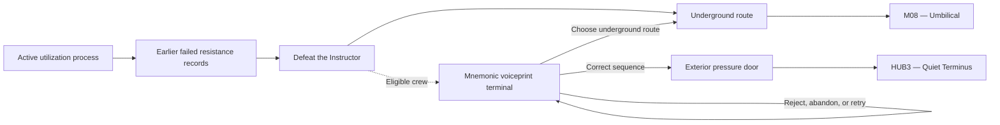

## Purpose

> **TODO — Mission population:** Define the utilization escape, Instructor Encounter, evidence placement, voiceprint controls, exterior-route staging, rewards, and supporting dialogue in a later population pass.

Escape utilization, defeat the Instructor, and choose between the normal underground route to the Cradle and an eligibility-gated exterior exit.

## Route split

Entering either physical exit commits the campaign to that route. The exterior route activates the legacy rail and relocates all four Recovery Capsules to [[Missions/HUB3|HUB3 — Quiet Terminus]]. Successful extraction may instead return to [[Missions/HUB2|HUB2]] before committing; failure returns there.

## Exterior eligibility

| Requirement | Function |
|---|---|
| All twelve Specializations | Complete the four Character mnemonic voiceprints and enable the terminal. |
| Four Act II Biome Memory Imprints | Identify each crew voice's alternate word and collectively teach the order. |

Ineligible players see an inert background terminal, receive no missing-content message, and proceed underground normally. After the Instructor falls for an eligible crew, four waveform channels illuminate, each Character faintly hears their mapped word, and the Biome Memory Imprints briefly resonate without showing a counter or unlock message.

## Voiceprint sequence

| Character | Spoken code word |
|---|---|
| ROOK | **Bastion** |
| VECTOR | **Azimuth** |
| RAM | **Breach** |
| RELAY | **Echo** |

The player arranges and replays the four recordings before submitting **BASTION–AZIMUTH–BREACH–ECHO**. Wrong submissions reject authentication but permit retries. Correct authentication impersonates the four complete Imprint Zero reference profiles; the camera shifts forward and reveals an exterior pressure door previously disguised as part of the wall.

## Evidence boundary

Every available return record ends in utilization, and earlier resistance fails inside B07. No preserved record shows another complete crew reaching B08. This makes the current crew the first recorded intact success without proving that no one ever escaped.
