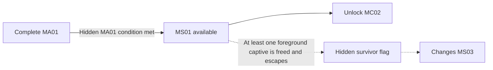

## Biome Memory Imprint

> **TODO — Discovery staging:** Define carrier-tone audibility, maintenance-passage readability, relay-booth geometry, and communication-buffer interaction feedback. Validate access across every Character and Specialization.

> **Accepted** — A faint repeating carrier tone leads through an unmarked maintenance passage to an abandoned relay booth. Any Character and Specialization can inspect its damaged communication buffer to collect the [[Imprints/Overview#extended-route-prerequisites|B03 biome Memory Imprint]]. Discovery requires no captive rescue, Character-specific ability, or shortcut completion and remains independent of the survivor condition.

This memory supplies the opening relationship in [[Missions/M07#voiceprint-sequence|M07's voiceprint sequence]]. Its narrative delivery is owned by the cutscene below.

## Cutscenes

> **TODO — Perspective production:** Adapt the storyboard's framing, timing, and sound to the accepted Character emphases below. Preserve the same evidence and opening relationship in every version.

> **TODO — Storyboard generation prompt:** Generate a four-panel, 2×2 anime-style production storyboard sheet with widescreen panels. Use the crew's Character references consistently. Depict a fragmentary emergency exchange, not a puzzle interface. Panel 1: a worn institutional communication station during an unresolved emergency; suggest B03's archive-associated material language without confirming the event's location. Panel 2: the other crew members wait for ROOK's response, with their activity held rather than showing a numbered sequence. Panel 3: ROOK speaks into the communication link; leave speech lettering absent for authored dialogue to be added later. Panel 4: the others begin to proceed only after his response; end before any later code words or the operation's outcome. Use austere charcoal linework, restrained olive and aged-ivory washes, weak fluorescent light, and worn analog hardware. No authentication UI, sequence numbers, subtitles, origin-revealing imagery, neon wash, or heroic framing. Layout and camera choices are proposals pending review.

> **TODO — Timing and audio:** Stage the pause, ROOK's authored response from the linked M07 sequence, and the others' resumption so the opening relationship is inferable without an explicit puzzle explanation.

> **Accepted** — A fragmentary emergency exchange shows the others waiting for ROOK's [[Missions/M07#voiceprint-sequence|mapped voiceprint response]] before proceeding. Each recovering Character emphasizes a different part of the exchange, but ROOK's word and opening position remain consistent. The scene presents remembered procedure, not a numbered puzzle clue.

### Character perspectives

| Recovering Character | Accepted emphasis |
|---|---|
| ROOK | The pressure of everyone waiting for his response |
| VECTOR | Watching for the moment she can move |
| RAM | Holding a position until the response arrives |
| RELAY | Hearing the communication channel remain open in silence |

The perspectives change personal experience, not the event or its ordering evidence.

## Purpose

Survey and restore a dormant transit connection while transitioning from B03 into B05, establish an apparently optional shortcut to MC02, and silently establish one condition for the Communion route.

## Mission framing

| Layer | MS01 direction |
|---|---|
| OPERATOR briefing | Verify structural integrity, restore transit controls, clear automated defenses, and establish an alternate approach into Verdant Null. |
| Immediate benefit | The crew gains a real cross-biome route and restores an evacuation path for stranded survivors. |
| Unexpected discovery | Background evacuees and foreground captives are using or confined within the dormant connection. |
| Hidden result | Evacuating at least one freed foreground captive sets the survivor flag revealed during MS03. |

## Progression

MS01 completion unlocks MC02 whether or not the hidden survivor condition is met. MC01 remains available and replayable.

## Hidden survivor condition

A staged background evacuation shows non-aggressive survivors affected by MA01's memory broadcast moving through the dormant transit connection. Opening passages, disabling hazards, or activating controls advances them between safe background positions, establishing that altered people use the route without making them the secret condition.

Separate foreground captives are confined in cells and may initially resemble enemies. They receive no hostile target indicator or enemy health bar, do not attack, and move defensively or hesitate. Automatic targeting does not lock onto them, but direct player attacks can still harm or kill them. Their cells use ordinary containment language without a rescue icon. The player must notice them, deliberately open at least one cell, refrain from killing the released captive, and allow them to join the staged evacuation. Once released, they transition into the protected background flow rather than becoming fragile escort NPCs. At least one foreground captive reaching the escape route stores the hidden campaign flag.

Do not present the foreground rescue as an objective, checklist item, route requirement, or explicit completion reward. The consequence is revealed diegetically in MS03. The flag may be earned on any MS01 replay, persists for the current campaign once set, and resets with a new campaign.
