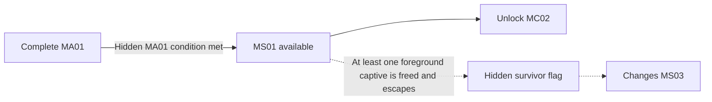

## Purpose

Survey and restore a dormant transit connection while transitioning from B03 into B05, establish an apparently optional shortcut to MC02, and silently establish one condition for the Communion route.

## Mission framing

| Layer | MS01 direction |
|---|---|
| OPERATOR briefing | Verify structural integrity, restore transit controls, clear automated defenses, and establish an alternate approach into Verdant Null. |
| Immediate benefit | The crew gains a real cross-biome route and restores an evacuation path for stranded survivors. |
| Unexpected discovery | Background evacuees and foreground captives are using or confined within the dormant connection. |
| Hidden result | Evacuating at least one freed foreground captive sets the survivor flag revealed during MS03. |

## Progression

MS01 completion unlocks MC02 whether or not the hidden survivor condition is met. MC01 remains available and replayable.

## Hidden survivor condition

A staged background evacuation shows non-aggressive survivors affected by MA01's memory broadcast moving through the dormant transit connection. Opening passages, disabling hazards, or activating controls advances them between safe background positions, establishing that altered people use the route without making them the secret condition.

Separate foreground captives are confined in cells and may initially resemble enemies. They receive no hostile target indicator or enemy health bar, do not attack, and move defensively or hesitate. Automatic targeting does not lock onto them, but direct player attacks can still harm or kill them. Their cells use ordinary containment language without a rescue icon. The player must notice them, deliberately open at least one cell, refrain from killing the released captive, and allow them to join the staged evacuation. Once released, they transition into the protected background flow rather than becoming fragile escort NPCs. At least one foreground captive reaching the escape route stores the hidden campaign flag.

Do not present the foreground rescue as an objective, checklist item, route requirement, or explicit completion reward. The consequence is revealed diegetically in MS03. The flag may be earned on any MS01 replay, persists for the current campaign once set, and resets with a new campaign.
