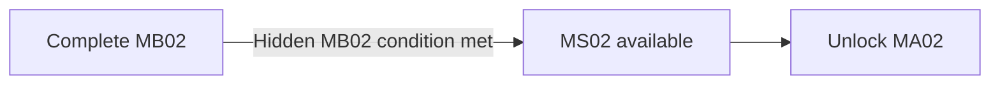

## Biome Memory Imprint

> **TODO — Hidden discovery:** Author the hidden location, challenge, and crew-specific memory payload for this Mission's [[Imprints/Overview#extended-route-prerequisites|B04 biome Memory Imprint]]. Keep its collection separate from shortcut completion and other hidden ending conditions.

## Purpose

Recover an earlier squad's command recorder while transitioning visually and spatially from B04 into B03 and providing an apparently optional shortcut to MA02.

## Narrative evidence

The recovered command recorder suggests that an earlier squad questioned or resisted its orders. Its partial record cannot prove who authored those orders, whether OPERATOR relayed them, or what happened after the recording ended.

## Progression

MA01 remains available and replayable if MA02 is reached through this shortcut.
