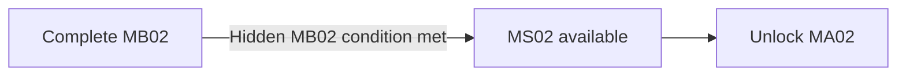

## Biome Memory Imprint

> **TODO — Discovery staging:** Define how the side route and auxiliary buffer remain perceptible without an objective marker; validate its interaction feedback and access with every Character and Specialization.

> **Accepted** — An unmarked auxiliary communications buffer lies off the route to the required command recorder. Any Character and Specialization can inspect it to collect the [[Imprints/Overview#extended-route-prerequisites|B04 biome Memory Imprint]]. Recovering the required recorder or completing the shortcut does not collect the Imprint; no Character-specific ability gate applies.

The memory establishes VECTOR's mapped response, **Azimuth**, as following ROOK's opening response. The fragment does not display a numbered sequence, identify who issued the order, or prove what happened to the squad. Its narrative delivery is owned by the cutscene below.

## Cutscenes

> **TODO — Scene production:** Review perspective-specific framing, timing, audio, and the transition from discovery into memory. Do not turn the fragment into a puzzle interface or treat the recorder's partial account as authoritative.

> **TODO — Storyboard generation prompt:** Generate a four-panel, 2×2 comic-page or anime-style production storyboard sheet showing a fragmentary squad exchange around orbital deployment infrastructure. Establish that ROOK has already responded without replaying MS01's opening scene; show activity held until VECTOR acknowledges on a clipped communication channel, then resuming without revealing later responses or the operation's outcome. Keep the source and authority of the order unreadable. Use B04's curved pressure ribs and docking clamps as visual language without establishing where the remembered event occurred. No sequence numbers, authentication UI, generated dialogue lettering, or origin-revealing imagery. Framing and camera choices remain proposals for review.

> **Accepted** — The same fragment presents the pause between ROOK's opening response and VECTOR's acknowledgement from the recovering Character's perspective. VECTOR's word and second position remain consistent; no perspective reveals the later voices or identifies who issued the order.

### Character perspectives

| Recovering Character | Accepted emphasis |
|---|---|
| ROOK | Hears that his response did not complete the exchange. |
| VECTOR | Experiences the pause before answering **Azimuth**. |
| RAM | Holds position until VECTOR's acknowledgement. |
| RELAY | Notices the channel remain open between the two responses. |

## Purpose

Recover an earlier squad's command recorder while transitioning visually and spatially from B04 into B03 and providing an apparently optional shortcut to MA02.

## Narrative evidence

The recovered command recorder suggests that an earlier squad questioned or resisted its orders. Its partial record cannot prove who authored those orders, whether OPERATOR relayed them, or what happened after the recording ended.

## Progression

MA01 remains available and replayable if MA02 is reached through this shortcut.
