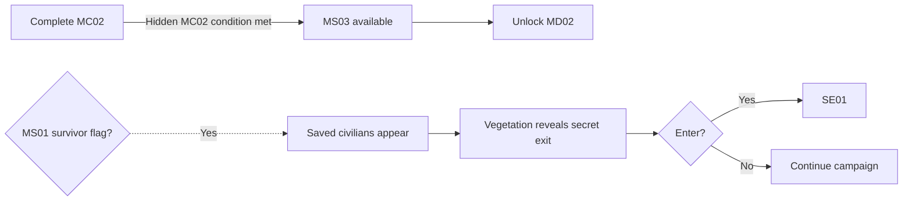

## Biome Memory Imprint

> **TODO — Discovery staging:** Define how the unmarked service alcove and memory buffer are perceptible without an objective marker; validate inspection feedback and access with every Character and Specialization.

> **Accepted** — An unmarked service alcove off the ordinary route holds a damaged local memory buffer. Any Character and Specialization can inspect it to collect the [[Imprints/Overview#extended-route-prerequisites|B05 biome Memory Imprint]]. Collection does not require the MS01 survivor flag, access to the vegetation passage, or shortcut completion; none of those collects the Imprint automatically.

The memory establishes RAM's mapped response, **Breach**, as third, following VECTOR's response. The fragment shows the others holding at a barrier until he responds. The buffer records the crew exchange, not evidence of where the crew originated. Its narrative delivery is owned by the cutscene below.

## Cutscenes

> **TODO — Scene production:** Review perspective-specific framing, timing, audio, and the transition from discovery into memory. Do not show the full code sequence or treat this memory as proof of crew origin.

> **TODO — Storyboard generation prompt:** Generate a four-panel, 2×2 comic-page or anime-style production storyboard sheet depicting an incomplete crew exchange at a barrier. Establish that VECTOR's response has preceded the present pause without replaying the earlier memories. Hold the others' activity until RAM gives his mapped response; show the activity changing afterward without revealing the fourth voice, the barrier's purpose, or the outcome. Use B05's damp, root-threaded industrial language as a visual connection without establishing where the remembered event occurred. No authentication UI, sequence numbers, generated dialogue lettering, origin-revealing imagery, or Communion-route imagery. Framing and camera choices remain proposals for review.

> **Accepted** — Each recovering Character experiences the same pause at the barrier differently. RAM's word and third position remain consistent; the fourth response is not heard and no perspective establishes the crew's origin.

### Character perspectives

| Recovering Character | Accepted emphasis |
|---|---|
| ROOK | Notices the crew holding position rather than advancing on his earlier response. |
| VECTOR | Watches for RAM's signal before moving. |
| RAM | Feels the pressure of being the one who must answer at the barrier. |
| RELAY | Hears the channel remain open while the crew waits for RAM. |

## Purpose

Transition visually and spatially from B05 into B06, provide an apparently optional shortcut to MD02, and conditionally reveal the optional passage to SE01.

## Narrative evidence

Buried biological-production infrastructure and signs of escape suggest that altered people survived outside institutional control. The environment supports several origin theories without proving that the crew came through the same process.

## Progression

Normal completion unlocks MD02 regardless of the hidden flag. Entering the vegetation passage also counts as successful MS03 completion: MS03 becomes replayable, MD02 unlocks, and SE01 begins immediately. MD01 remains available and replayable if MD02 is reached through this shortcut.

## Communion passage

If at least one altered civilian was helped to escape in MS01, the survivor appears moving through MS03's background toward an exit sealed by vegetation. The vegetation retracts when the survivor reaches it, exposing the passage without an objective marker or unlock message.

Entering is optional. Ignoring the passage and finishing MS03 normally preserves the standard campaign path and does not clear the survivor flag. If the flag is earned by replaying MS01 after an earlier MS03 completion, replaying MS03 reveals the passage. The flag resets only when a new campaign begins.
