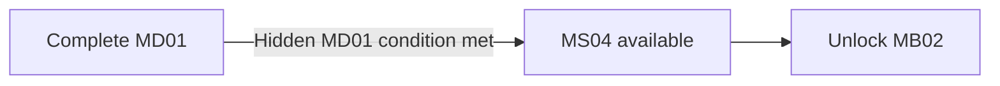

## Biome Memory Imprint

> **TODO — Hidden discovery:** Author the hidden location, challenge, and crew-specific memory payload for this Mission's [[Imprints/Overview#extended-route-prerequisites|B06 biome Memory Imprint]]. Keep its collection separate from shortcut completion and other hidden ending conditions.

## Purpose

Intercept an escaping program architect while transitioning visually and spatially from B06 into B04, complicating OPERATOR's directive history, and providing an apparently optional shortcut to MB02.

## Narrative evidence

The escaping architect carries evidence that a command directive changed. The record may implicate an institution, relay, or OPERATOR-associated interface, but cannot prove who changed the directive, whether the change was autonomous, or whether OPERATOR is one entity.

## Progression

MB01 remains available and replayable if MB02 is reached through this shortcut. Evidence may suggest that OPERATOR's directive changed, but must not establish who changed it or whether OPERATOR acts as one entity.
