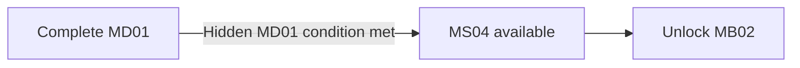

## Biome Memory Imprint

> **TODO — Discovery staging:** Define how the disused gate and unmarked service terminal are perceptible without an objective marker; validate inspection feedback and access with every Character and Specialization.

> **Accepted** — An unmarked service terminal beside a disused access gate lies off the architect's required escape route. Any Character and Specialization can inspect its retained communication fragment to collect the [[Imprints/Overview#extended-route-prerequisites|B06 biome Memory Imprint]]. Intercepting the architect or completing the shortcut does not collect the Imprint. The terminal's fragment is separate from the architect's directive-change record.

The memory establishes RELAY's mapped response, **Echo**, as the closing response after RAM. The crew proceeds once the channel closes. This memory neither replays the full sequence nor proves who issued or changed the architect's directive. Its narrative delivery is owned by the cutscene below.

## Cutscenes

> **TODO — Scene production:** Review perspective-specific framing, timing, audio, and the transition from discovery into memory. Do not merge the memory with the architect's required evidence or establish the authority behind either record.

> **TODO — Storyboard generation prompt:** Generate a four-panel, 2×2 comic-page or anime-style production storyboard sheet of a fragmentary squad exchange. Show the crew held after RAM's response without replaying the earlier words. RELAY gives her mapped response over an open channel; only then does the channel close and the crew proceed. Keep the operation, command authority, and result unreadable. Use B06's corporate transfer infrastructure, repeated access gates, numbered lanes, and distant authorization chimes as visual and audio language without establishing where the remembered event occurred. No sequence numbers, authentication UI, generated dialogue lettering, or origin-revealing imagery. Framing and camera choices remain proposals for review.

> **Accepted** — Each recovering Character experiences the same closing exchange differently. RELAY's word and final position remain consistent; no perspective identifies the command authority or connects this exchange to the architect's directive-change record.

### Character perspectives

| Recovering Character | Accepted emphasis |
|---|---|
| ROOK | Waits despite having given the opening response. |
| VECTOR | Watches for the crew to move after the final acknowledgement. |
| RAM | Maintains position until RELAY answers. |
| RELAY | Gives **Echo** and hears the channel close. |

## Purpose

Intercept an escaping program architect while transitioning visually and spatially from B06 into B04, complicating OPERATOR's directive history, and providing an apparently optional shortcut to MB02.

## Narrative evidence

The escaping architect carries evidence that a command directive changed. The record may implicate an institution, relay, or OPERATOR-associated interface, but cannot prove who changed the directive, whether the change was autonomous, or whether OPERATOR is one entity.

## Progression

MB01 remains available and replayable if MB02 is reached through this shortcut. Evidence may suggest that OPERATOR's directive changed, but must not establish who changed it or whether OPERATOR acts as one entity.
