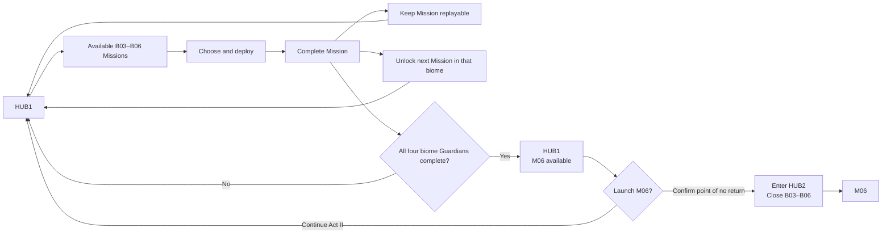

## Campaign progression

This page records the current Mission unlocks, branches, Hub transitions, and endings. Exact secret-access interactions remain open where noted on the relevant Imprint and Mission pages.

### Complete campaign

```mermaid
graph TD
    %% =====================================================
    %% ACT 1 — LINEAR INTRODUCTION
    %% =====================================================

    START([New Game])

    subgraph B01["B01 — Ashfall District"]
      M01["M01<br/>Cold Deployment"]
      HUB0.1["HUB0<br/>Meet VECTOR"]
      M02["M02<br/>Containment Doctrine"]
      HUB0.2["HUB0"]
      M03["M03<br/>No Survivors Logged"]
    end
    HUB0.3["HUB0<br/>Meet RAM"]
    subgraph B02["B02 — Helix Foundry"]
      M04["M04<br/>Production Halt"]
      HUB0.4["HUB0"]
      M05["M05<br/>The Four Trials"]
    end
    HUB1["HUB1<br/>Campaign Hub<br/>Choose Biome"]

    START --> M01
    M01 --> HUB0.1
    HUB0.1 --> M02
    M02 --> HUB0.2
    HUB0.2 --> M03
    M03 --> HUB0.3
    HUB0.3 --> M04
    M04 --> HUB0.4
    HUB0.4 --> M05
    M05 --> HUB1

    %% =====================================================
    %% ACT 2 — OPEN BIOME CAMPAIGN
    %% =====================================================

    subgraph B03["B03 — Mnemonic Basilica"]
        MA01["MA01<br/>Ghost Archive"]
        MA02["MA02<br/>Familiar Strangers"]
        MA03["MA03<br/>The Choir of Selves"]

        MA01 --> MA02
        MA02 --> MA03
    end

    subgraph B04["B04 — The Fallen Halo"]
        MB01["MB01<br/>Vertical Front"]
        MB02["MB02<br/>Dead Reinforcements"]
        MB03["MB03<br/>Halo Protocol"]

        MB01 --> MB02
        MB02 --> MB03
    end

    subgraph B05["B05 — Verdant Null"]
        MC01["MC01<br/>Burn the Garden"]
        MC02["MC02<br/>Voices Under Glass"]
        MC03["MC03<br/>Heartroot"]

        MC01 --> MC02
        MC02 --> MC03
    end

    subgraph B06["B06 — Sovereign Stack"]
        MD01["MD01<br/>Hostile Acquisition"]
        MD02["MD02<br/>Executive Immunity"]
        MD03["MD03<br/>Patent of Life"]

        MD01 --> MD02
        MD02 --> MD03
    end


    %% =====================================================
    %% FIRST HUB CONNECTIONS
    %% =====================================================

    HUB1 --> MA01
    HUB1 --> MB01
    HUB1 --> MC01
    HUB1 --> MD01


    %% =====================================================
    %% BIOME COMPLETION CHECK
    %% =====================================================

    MA03 --> CHECK
    MB03 --> CHECK
    MC03 --> CHECK
    MD03 --> CHECK

    CHECK{"All Biome Guardians defeated?"}

    CHECK -->|No| HUB1
    CHECK -->|Yes| READY["HUB1<br/>M06 available"]
    READY -->|Launch M06<br/>Point of no return| HUB2


    %% =====================================================
    %% OPTIONAL SPECIAL-MISSION PATHS
    %% =====================================================

    MB02 -.->|Trace an earlier deployment signal| MS01
    subgraph B04
      MS01["MS01<br/>Black-Box Recovery"]
    end
    MS01 -.->|Cradle security codes recovered| MB03

    MC02 -.->|Follow the source-memory voices| MS02
    subgraph B05
      MS02["MS02<br/>Beneath the Skin"]
    end
    MS02 -.->|Return with forbidden knowledge| MC03

    MD02 -.->|Intercept the escaping architect| MS03
    subgraph B06
      MS03["MS03<br/>Golden Parachute"]
    end
    MS03 -.->|OPERATOR's altered directive exposed| MD03


    %% =====================================================
    %% OPTIONAL EARLY SECRET ENDING
    %% =====================================================

    CHECK_SE01{"Enter the Living Archive?"}
    MS02 -.->|Living passage revealed| CHECK_SE01
    CHECK_SE01 -.->|Enter| SE01
    CHECK_SE01 -.->|Turn back| MC03
    SECRET_ENDING([Secret Ending<br/>Communion])

    subgraph B99["B99 — The Living Archive"]
      SE01["SE01<br/>Become Many"]
    end
      SE01 -->|Join the Continuum| SECRET_ENDING



    %% =====================================================
    %% ACT 3 — SECOND HUB
    %% =====================================================

    HUB2["HUB2<br/>Guardian Nexus<br/>Final Assault Hub"]
    subgraph B07["B07 — The Empty Barracks"]
      M06["M06<br/>Welcome Home"]
      M07["M07<br/>Recall Exercise"]
    end
    subgraph B08["B08 — The Cradle"]
      M08["M08<br/>Umbilical"]
      M09["M09<br/>Imprint Zero"]
    end
    STANDARD_ENDING([Standard Ending<br/>Cycle Broken])

    HUB2 --> M06
    M06 --> M07
    M07 --> M08
    M08 --> M09
    M09 --> STANDARD_ENDING


    %% =====================================================
    %% SECRET ENDGAME ROUTE
    %% Branches from M07 and leads to a separate ending
    %% =====================================================
    HS01["HS01<br/>The Last Civilian"]
    SECRET_SPLIT{"Choose an investigation"}

    M07 -.->|All Specializations + B03–B06 biome Memory Imprints| HS01

    subgraph B09["B09 — Republic of Dust"]
      HS01 -->|Two evidence trails uncovered| SECRET_SPLIT
    end




    %% =====================================================
    %% SECRET BRANCH A
    %% =====================================================

    SECRET_SPLIT -->|Trace the source memories| HA01

    subgraph B10["B10 — Genesis Vault"]
      HA01["HA01<br/>Donor Class"]
      HA02["HA02<br/>Composite Trials"]
      HA03["HA03<br/>The First Zero"]
    end

    HA01 --> HA02
    HA02 --> HA03
    HA03 -->|Take control of the crew's Imprints| SECRET_JOIN


    %% =====================================================
    %% SECRET BRANCH B
    %% =====================================================

    SECRET_SPLIT -->|Pursue OPERATOR's command network| HB01

    subgraph B09
      HB01["HB01<br/>Martial Law"]
    end
    subgraph B11["B11 — Cathedral of Command"]
      HB02["HB02<br/>Chain of Command"]
      HB03["HB03<br/>Perfect Soldier"]
      HB04["HB04<br/>Final Directive"]
    end

    HB01 -->|Follow the military network| HB02
    HB02 --> HB03
    HB03 --> HB04
    HB04 -->|Seize OPERATOR's infrastructure| SECRET_JOIN


    %% =====================================================
    %% SECRET BRANCHES REJOIN
    %% =====================================================

    subgraph B12["B12 — White Horizon"]
      SECRET_JOIN["HS02<br/>Outside Context"]
      SECRET_BOSS["HS03<br/>No Original"]
    end
    TRUE_ENDING([True Ending<br/>Imprint Zero])

    SECRET_JOIN -->|Reach the planetary archive| SECRET_BOSS


    SECRET_BOSS -->|Reject OPERATOR's definition of personhood| TRUE_ENDING


    %% =====================================================
    %% MISSION PAGE LINKS
    %% =====================================================

    click M01 href "#/missions/m01"
    click M02 href "#/missions/m02"
    click M03 href "#/missions/m03"
    click M04 href "#/missions/m04"
    click M05 href "#/missions/m05"
    click M06 href "#/missions/m06"
    click M07 href "#/missions/m07"
    click M08 href "#/missions/m08"
    click M09 href "#/missions/m09"

    click MA01 href "#/missions/ma01"
    click MA02 href "#/missions/ma02"
    click MA03 href "#/missions/ma03"
    click MB01 href "#/missions/mb01"
    click MB02 href "#/missions/mb02"
    click MB03 href "#/missions/mb03"
    click MC01 href "#/missions/mc01"
    click MC02 href "#/missions/mc02"
    click MC03 href "#/missions/mc03"
    click MD01 href "#/missions/md01"
    click MD02 href "#/missions/md02"
    click MD03 href "#/missions/md03"

    click MS01 href "#/missions/ms01"
    click MS02 href "#/missions/ms02"
    click MS03 href "#/missions/ms03"
    click SE01 href "#/missions/se01"
    click HS01 href "#/missions/hs01"
    click SECRET_JOIN href "#/missions/hs02"
    click SECRET_BOSS href "#/missions/hs03"
    click HA01 href "#/missions/ha01"
    click HA02 href "#/missions/ha02"
    click HA03 href "#/missions/ha03"
    click HB01 href "#/missions/hb01"
    click HB02 href "#/missions/hb02"
    click HB03 href "#/missions/hb03"
    click HB04 href "#/missions/hb04"

    click HUB0.1 href "#/missions/hub0"
    click HUB0.2 href "#/missions/hub0"
    click HUB0.3 href "#/missions/hub0"
    click HUB0.4 href "#/missions/hub0"
    click HUB1 href "#/missions/hub1"
    click READY href "#/missions/hub1"
    click HUB2 href "#/missions/hub2"


    %% =====================================================
    %% VISUAL STYLES
    %% =====================================================

    classDef intro fill:#dbeafe,stroke:#2563eb,color:#1e3a8a,stroke-width:2px;

    classDef hub fill:#fef3c7,stroke:#d97706,color:#92400e,stroke-width:3px;

    classDef biome fill:#dcfce7,stroke:#16a34a,color:#14532d,stroke-width:2px;

    classDef boss fill:#fee2e2,stroke:#dc2626,color:#7f1d1d,stroke-width:3px;

    classDef secret fill:#f3e8ff,stroke:#9333ea,color:#581c87,stroke-width:2px;

    classDef final fill:#ffe4e6,stroke:#be123c,color:#881337,stroke-width:3px;

    classDef choice fill:#ffedd5,stroke:#ea580c,color:#7c2d12,stroke-width:3px;

    classDef ending fill:#e0e7ff,stroke:#4338ca,color:#312e81,stroke-width:3px;

    classDef secretEnding fill:#fae8ff,stroke:#c026d3,color:#701a75,stroke-width:3px;


    %% =====================================================
    %% CLASS ASSIGNMENTS
    %% =====================================================

    class M01,M02,M03,M04,M05 intro;

    class HUB1,READY,HUB0.1,HUB0.2,HUB0.3,HUB0.4,HUB2,CHECK,CHECK_SE01 hub;

    class MA01,MA02,MB01,MB02,MC01,MC02,MD01,MD02 biome;

    class MA03,MB03,MC03,MD03,M09,SECRET_BOSS boss;

    class MS01,MS02,MS03,SE01,HS01,HA01,HA02,HA03,HB01,HB02,HB03,HB04,SECRET_JOIN secret;

    class M06,M07,M08 final;

    class SECRET_SPLIT choice;

    class START,STANDARD_ENDING,TRUE_ENDING ending;

    class SECRET_ENDING secretEnding;
```

> **Reading Act II:** Arrows between Missions inside B03–B06 show unlock order, not immediate deployment. Every completed Mission returns the player to HUB1, remains replayable, and adds the next Mission from that biome to the available pool. After the fourth Guardian, the player returns to HUB1 with M06 available.

### Act II Mission availability

The initial pool contains MA01, MB01, MC01, and MD01. Completing, for example, MB01 returns the player to HUB1 with MB01 still replayable and MB02 newly available. This continues independently in each biome until all four Guardian Missions are complete. After the fourth Guardian, the player returns to HUB1 with M06 available and may continue replaying Act II Missions.

Launching M06 requires explicit confirmation that B03–B06 and their undiscovered rewards will become unavailable for the campaign. All Specialization Imprints and the four biome Memory Imprints needed for the extended route must be recovered before confirming. Eligibility is locked before M06; the resulting hidden access appears during M07.

## Mission index

Mission pages own gameplay style, encounter content, timing, enemies, and implementation detail. This index records only campaign placement and current documentation status.

| Mission | Biome | Campaign role | Status |
|---|---|---|---|
| [[Missions/M01|M01 — Cold Deployment]] | B01 | Controlled introduction: ROOK | TODO |
| [[Missions/HUB0|HUB0 — Crew Assembly Hub]] | — | Act I return and roster assembly | In progress |
| [[Missions/M02|M02 — Containment Doctrine]] | B01 | Controlled introduction: ROOK or VECTOR | TODO |
| [[Missions/M03|M03 — No Survivors Logged]] | B01 | Controlled introduction: RAM arrival | TODO |
| [[Missions/M04|M04 — Production Halt]] | B02 | Special introduction: RAM and RELAY | TODO |
| [[Missions/M05|M05 — The Four Trials]] | B02 | Full-crew exception; Overdrive reveal | TODO |
| [[Missions/HUB1|HUB1 — Campaign Hub]] | — | Open Act II selection and replay | In progress |
| [[Missions/MA01|MA01 — Ghost Archive]] | B03 | Act II opening Mission | TODO |
| [[Missions/MA02|MA02 — Familiar Strangers]] | B03 | Act II continuation | TODO |
| [[Missions/MA03|MA03 — The Choir of Selves]] | B03 | B03 Guardian | TODO |
| [[Missions/MB01|MB01 — Vertical Front]] | B04 | Act II opening Mission | TODO |
| [[Missions/MB02|MB02 — Dead Reinforcements]] | B04 | Act II continuation | TODO |
| [[Missions/MS01|MS01 — Black-Box Recovery]] | B04 | Optional Special Mission | TODO |
| [[Missions/MB03|MB03 — Halo Protocol]] | B04 | B04 Guardian | TODO |
| [[Missions/MC01|MC01 — Burn the Garden]] | B05 | Act II opening Mission | TODO |
| [[Missions/MC02|MC02 — Voices Under Glass]] | B05 | Act II continuation | TODO |
| [[Missions/MS02|MS02 — Beneath the Skin]] | B05 | Optional Special Mission; Communion access | TODO |
| [[Missions/MC03|MC03 — Heartroot]] | B05 | B05 Guardian | TODO |
| [[Missions/MD01|MD01 — Hostile Acquisition]] | B06 | Act II opening Mission | TODO |
| [[Missions/MD02|MD02 — Executive Immunity]] | B06 | Act II continuation | TODO |
| [[Missions/MS03|MS03 — Golden Parachute]] | B06 | Optional Special Mission | TODO |
| [[Missions/MD03|MD03 — Patent of Life]] | B06 | B06 Guardian | TODO |
| [[Missions/SE01|SE01 — Become Many]] | B99 | Early Communion ending | TODO |
| [[Missions/HUB2|HUB2 — Guardian Nexus]] | — | Irreversible Act III staging | In progress |
| [[Missions/M06|M06 — Welcome Home]] | B07 | Standard endgame opening | TODO |
| [[Missions/M07|M07 — Recall Exercise]] | B07 | Standard path; hidden-route access | TODO |
| [[Missions/M08|M08 — Umbilical]] | B08 | Standard finale approach | TODO |
| [[Missions/M09|M09 — Imprint Zero]] | B08 | Standard ending | TODO |
| [[Missions/HS01|HS01 — The Last Civilian]] | B09 | Extended-route entry | TODO |
| [[Missions/HA01|HA01 — Donor Class]] | B10 | Memory-origin investigation | TODO |
| [[Missions/HA02|HA02 — Composite Trials]] | B10 | Memory-origin investigation | TODO |
| [[Missions/HA03|HA03 — The First Zero]] | B10 | Memory-origin investigation conclusion | TODO |
| [[Missions/HB01|HB01 — Martial Law]] | B09 | Command-system investigation entry | TODO |
| [[Missions/HB02|HB02 — Chain of Command]] | B11 | Command-system investigation | TODO |
| [[Missions/HB03|HB03 — Perfect Soldier]] | B11 | Command-system investigation | TODO |
| [[Missions/HB04|HB04 — Final Directive]] | B11 | Command-system investigation conclusion | TODO |
| [[Missions/HS02|HS02 — Outside Context]] | B12 | Extended-route convergence | TODO |
| [[Missions/HS03|HS03 — No Original]] | B12 | True final sequence | TODO |
