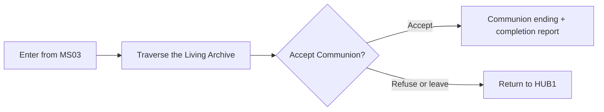

## Purpose

Enter the Living Archive and decide whether to join the [[NPCs/Continuum|Continuum]]'s preserved collective identity.

## Route outcome

Entering SE01 counts as successful MS03 completion and unlocks MD02, but it does not end the campaign automatically or announce a secret ending. Communion requires an explicit final choice. Refusing or leaving returns the player to HUB1, preserves the MS01 survivor flag, and allows the passage to be revisited through an MS03 replay. SE01 is never added directly to the HUB1 Mission list.
