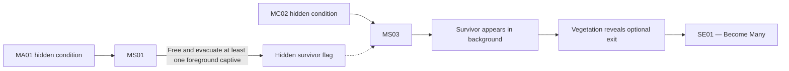

## Entry route

MS01 completion unlocks MC02 as an apparent shortcut whether or not the survivor flag is earned. Background survivors establish a staged evacuation, but do not satisfy the condition. The player must notice altered foreground captives, deliberately open at least one cell, refrain from killing the released captive, and allow at least one to join the protected evacuation route. Do not present this as an objective, checklist item, route requirement, or explicit reward.

The flag may be earned on any MS01 replay, persists for the current campaign, and resets with a new campaign. During MS03, the saved civilian runs toward an exit blocked by vegetation; the growth retracts when the survivor reaches it. The player may enter or ignore the passage. Entering counts as successful MS03 completion, registers it as replayable, unlocks MD02, and begins SE01 immediately. Ignoring the passage and finishing MS03 normally does not clear the flag, and later replays reveal it again.

## Narrative function

Communion offers an early ending before the Cradle confrontation. The Continuum presents collective preservation as an alternative to institutional replacement and erasure: identities may coexist without becoming one controlling voice.

The route provides evidence and testimony associated with previous crew-like identities but does not prove whether the active crew are clones, reconstructions, composites, synthetic people, or legal continuations. It does not resolve OPERATOR's identity, authority, knowledge, or relationship to erased records.

## SE01 outcome

| Final choice | Outcome |
|---|---|
| Accept Communion | End the campaign with Communion and produce its completion report. |
| Refuse or leave | Return to HUB1, preserve the survivor flag, and allow later re-entry through an MS03 replay. |

Entering [[Missions/SE01|SE01]] does not announce a secret ending or end the campaign automatically. SE01 never appears directly in HUB1's Mission list; returning requires replaying MS03 and taking the revealed passage again. The final decision explicitly communicates commitment before Communion occurs.

## Ending boundaries

- Communion must feel like a valid conclusion rather than failure.
- Distinct voices remain perceptible within the collective; joining is willing participation, not involuntary erasure.
- The ending resolves the immediate choice to preserve identity collectively without revealing the full Imprint program.
- Its completion report reveals the same `x/4` biome Memory Imprint and `x/12` Specialization totals used by other non-true endings.
- [[Biomes/B99|B99]] owns the Living Archive's environment; [[Missions/Overview|Campaign progression]] owns route topology and replay rules.
